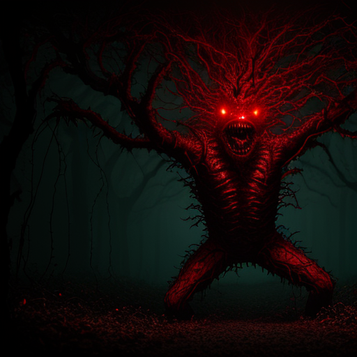

# The Architecture of the Upside Down: Generative AI Project

> *"A magia nada mais é do que matemática avançada e muito poder computacional."*

Este projeto explora os paralelos entre a lore de **Stranger Things 5** e a arquitetura técnica de **IA Generativa Moderna (Diffusion Models)**. Através de código Python, visualizamos como o ruído gaussiano (o "Vazio") é transformado em entidades complexas (o "Monstro") usando processos de Denoising e Espaço Latente.



## 📂 Estrutura do Projeto

| Arquivo/Pasta | Descrição Técnica | Metáfora Stranger Things |
| :--- | :--- | :--- |
| `summoning_vecna.py` | Script de geração de imagem única usando **Lykon/DreamShaper** (Fine-tuned SD 1.5). | O ritual de invocação completo, gerando a manifestação física final do Vecna em alta fidelidade. |
| `summoning_vecna_gif.py` | Script de geração de animação (GIF) frame-a-frame usando **Stable Diffusion v1.5 Base**. | O processo de materialização do Mind Flayer, mostrando a ordem surgindo do caos (Denoising Process). |
| `frames_vecna/` | Pasta contendo os frames intermediários do processo de difusão. | As "polaroids" tiradas durante a abertura do portal. |
| `vecna_summoned.png` | Output final em alta resolução (DreamShaper). | A foto da criatura após atravessar o portal. |
| `vecna_transformation.gif` | Timelapse do processo de remoção de ruído. | O vídeo de vigilância do laboratório de Hawkins. |
| `requirements.txt` | Lista de dependências Python (PyTorch CUDA, Diffusers, Transformers). | Os suprimentos necessários para a missão. |

## 🚀 Tecnologias Utilizadas

*   **Python 3.10**
*   **PyTorch (CUDA Edition):** Para aceleração de tensores via GPU.
*   **Hugging Face Diffusers:** Pipeline de Difusão Latente.
*   **Transformers:** Processamento de linguagem natural (CLIP) para entender o prompt.
*   **Modelos:**
    *   *Base:* `runwayml/stable-diffusion-v1-5` (Para a animação bruta)
    *   *Fine-Tuned:* `Lykon/DreamShaper` (Para o render artístico final)

## 🛠️ Como Rodar o Projeto

### 1. Preparar o Ambiente (The Void)
Certifique-se de ter Python instalado e crie um ambiente virtual:

```bash
py -3.10 -m venv .venv
# Windows
.\.venv\Scripts\activate
# Linux/Mac
source .venv/bin/activate
```

### 2. Instalar Suprimentos
Instale as bibliotecas com suporte a GPU (CUDA):

```bash
pip install -r requirements.txt
```

### 3. Invocar o Vecna (Gerar Imagem HD)
Este script usa o modelo **DreamShaper** para criar uma versão artística e realista.

```bash
python summoning_vecna.py
```

Output: `vecna_summoned.png`

### 4. Visualizar a Materialização (Gerar GIF)
Este script usa o Stable Diffusion 1.5 padrão para criar uma animação passo-a-passo do processo de denoising.

```bash
python summoning_vecna_gif.py
```

Output: `vecna_transformation.gif` e pasta `frames_vecna/`

## 🧠 Conceitos Técnicos Abordados

*   **Latent Space Navigation:** Navegação matemática em vetores multidimensionais para encontrar conceitos visuais.
*   **Denoising Diffusion Probabilistic Models (DDPMs):** O processo iterativo de remover ruído gaussiano para reconstruir dados.
*   **Prompt Conditioning:** Uso de embeddings de texto (CLIP) para guiar a geração da imagem (Classifier-Free Guidance).
*   **VAE Decoding:** Tradução de latents comprimidos de volta para pixels visíveis.

---

**Autor:** Pedro Farath
*Projeto desenvolvido para estudo comparativo entre Ficção Científica e Engenharia de IA.*

#StrangerThings #GenerativeAI #Python #PyTorch #StableDiffusion